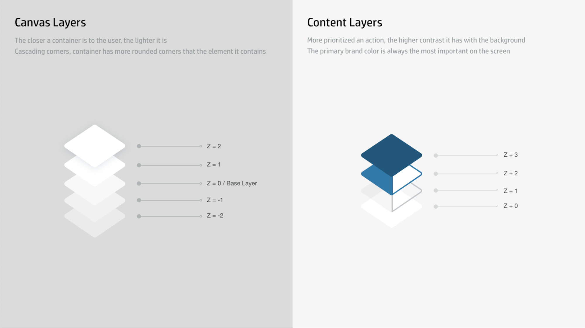
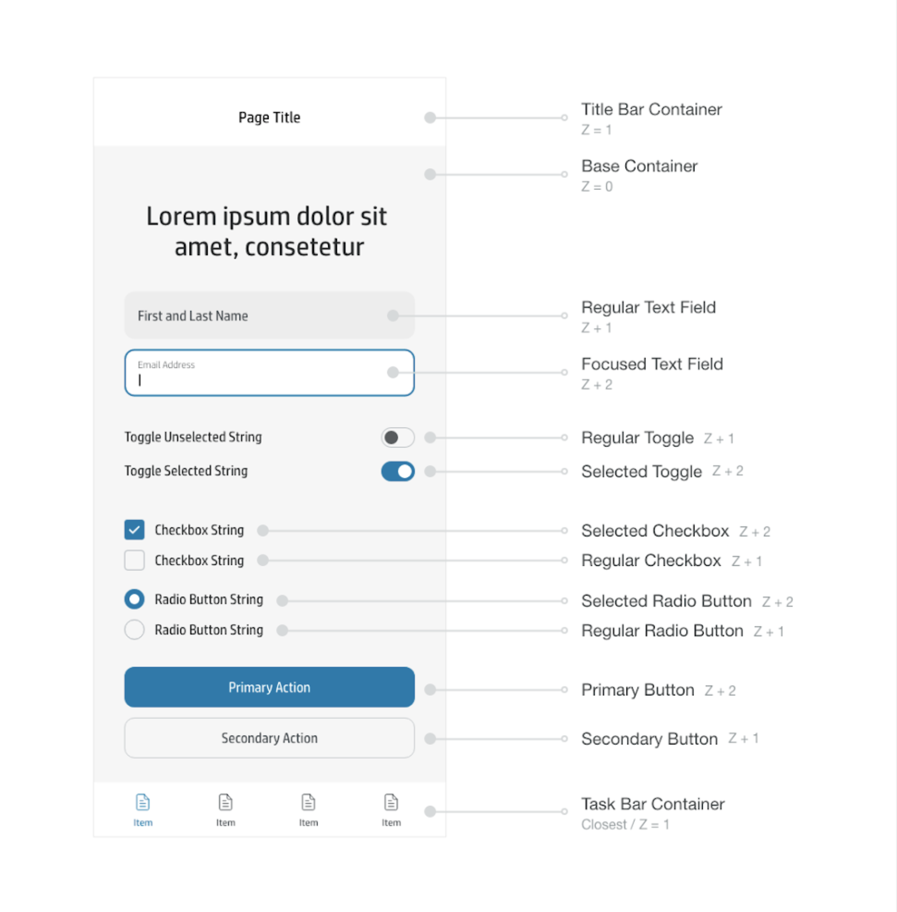
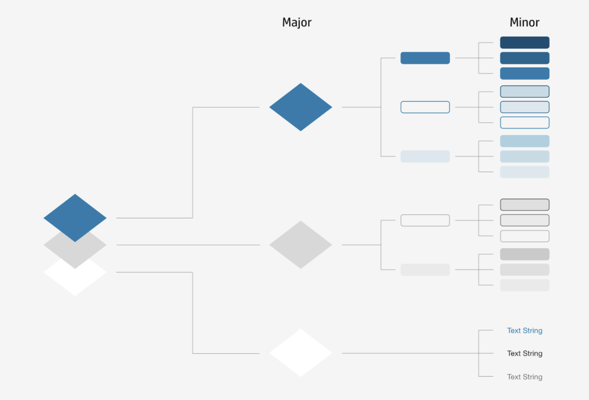
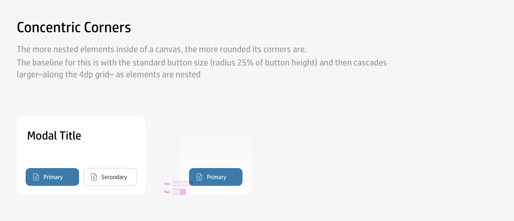
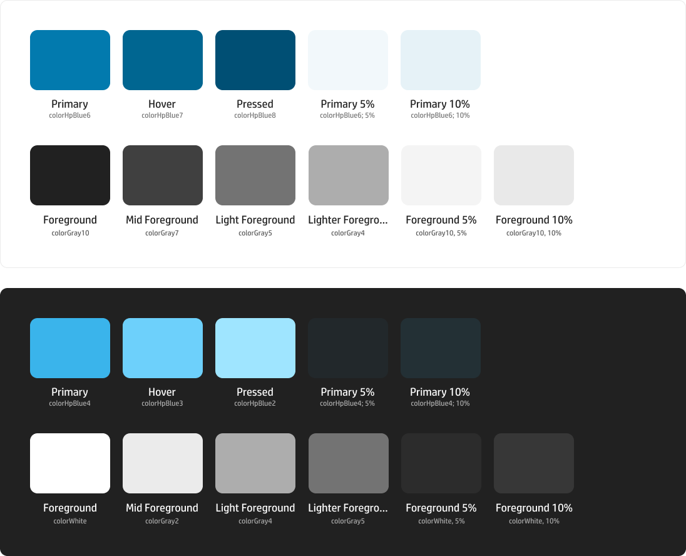
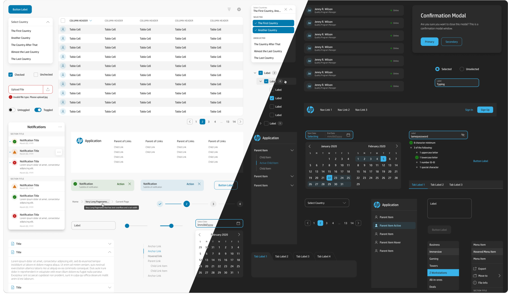

---

title: Systematizing a design system’s visual style
date: July 2019 - May 2020
company: HP
role: Designer, Design Lead
tags: [
    design, design systems
]

---

# Overview

Before learning about how we created the visual style for Veneer version 3, I would recommend reading more about the [overall Veneer 3 journey](https://www.austinmrobinson.com/redesigning-and-scaling-a-design-system/) and how it was scaled across HP using grassroots adoption.

A huge part of rebuilding Veneer from the ground up for version 3 was tied to creating a new, more scalable visual style.

# Objectives

Our objectives on creating this new visual style were anchored to the issues that we had with Veneer 2.

## Veneer 2 issues

* Only one mode (light mode).
* Only one component shape (sharp).
* Only one component size.
* The primary color was not accessible with white (which it was often used with).
* There was no documented logic for how components should be designed to fit into the overall system.

## Veneer 3 objectives

With this in mind, we realized that we needed a much more flexible system in order to fit the multitude of product needs across the company. We set out to build a system with:

* Multiple modes (light, dark, and high contrast).
* Two component shapes (round and sharp).
* Multiple component sizes (standard density, high density, and low density).
* Making the system accessible by default.
* Establishing a system for designing components.
  * This is important to note because tying the visual style to a system meant that it removed much of the subjectivity that is a part of a system’s visual style.

# Making it happen

If you have not read the case study on the Veneer 3 journey from start to finish, it is important to provide an excerpt from there for this.

> Once the foundations were established, it was time to get into the meat of the system: components and patterns. The foundation level is political as it is, but the visual style was even more so, given how subjective it can be. This was extremely important for us to nail, but I felt strongly that we needed more allies for it to work. If people didn’t feel like they had a hand in creating it, they would not want to use it. We identified the Print organization as our main ally here. Since the 3D group was still very new to the company, and Print had many legacy requirements, it made sense aligning with Print first. To do this, we scheduled a weeklong workshop in San Diego at the campus where they sat. I did a ton of prep going into this workshop, knowing full well how political discussions like this had been in the past, and knowing how subjectivity in design can kill even the most well-intentioned efforts. Once we arrived, we worked for the first two days on refining and agreeing upon the foundations we had established. Then, we moved on to trying to workshop a visual design style, using a design charrette to kickstart the creativity. It is meant to be an exercise to have people try a bunch of ideas, point out things they like in others, and try to implement it in their own. Ideally, after a few rounds, people continue to pull the good ideas from others into their own creation, and eventually everyone aligns. However, the first two rounds of this charrette did not go well at all. People were pointing out things they liked in others work, but there wasn’t much alignment to be found. They were arbitrarily designing their visual style off of their taste, so everyone’s looked very different, and the subjectivity of design prevented anything from getting traction. I thought if we created the style systematically, then it would cross these boundaries and make a style that was above reproach, so I created a first draft of a layer system to anchor each of the visual design elements to a “layer” that represented its level of emphasis on the page. And suddenly, everything clicked! The layer system and my visual design style were unanimously picked for the system moving forward, and we worked to expand it so that it worked as a system for creating components and patterns from scratch in Veneer. 

## Layer system

After this workshop with Print, we hit the ground running. We finally had a visual style to work with, so we could start building components. We needed to refine the layer system so that it could fit all of the use cases that we’d run into.

_The first version of our layer system._

With this first version, we were able to build out some of the first components for Veneer 3. The canvas layers evolved into what we call out elevation system, which establishes the z value of the containing element. This paired with the content layers gives a clear hierarchy to the style of each component and how they relate with one another. As a component is interacted with (hover, active/pressed, dragged, etc.), it ascends higher in the content and/or canvas layers.

_The visual style of the first components we made, based on the initial layer system._

With that layer system in place, we started building. However, we quickly realized that we needed to expand the layer system to something a bit more comprehensive. One of the main bits of feedback we received early on is that there wasn’t much blue in the mocks that people started building with the components. So, we decided to include more blue in the updated layer system. We also pulled out the canvas layers and put them in their own elevation system.

_The updated layer system, adding much more nuance and detail to each layer, including “Major” and “Minor” levels._

With this expanded layer system, it was easier for folks to understand the different color tiers we were leveraging. Most interactions would result in “Minor” jumps up the layers, but some warranted “Major” jumps. Once we had this in place, we were able to really double down and build out the rest of the components in the system.

## Iconography

Since Veneer 3 went towards a new icon style that the Print organization had created, the visual style of the system needed to match them. First, we cleaned up the icon style and built out a library of icons for the new version of the system. We created four styles: Round Lined, Round Filled, Sharp Lined, and Sharp Filled. This gave us the flexibility we were looking for in creating a flexible system. These icons, paired with the colors from the layer system, became the foundation for the overall visual style. Our default style, in alignment with the HP brand, was round. So our goal was to ensure that the round style had concentric corners across the board. As for sharp, everything for that style had no corner radius at all. 

_An example of how the iconography corners influenced the overall round visual style, using concentric corners._

## System colors

At the same time, we worked to establish what we call our “System” colors, which are a subset of our global color palette that we use for the components. They work across the three color modes in Veneer. A huge part of creating these system colors was providing colors that (if used properly) would ensure that designers and developers were creating accessible experiences. If you’d like to read more about Veneer’s modes, you can do so [here](https://drive.google.com/file/d/1yC0RXXHB0HC9cQKWLvFsLCKVqUaRc7sQ/view?usp=sharing).

_A few colors from the Veneer system colors for light and dark mode._

After a long time (~9-12 months), we had created a component library based on the new Veneer design language, layer system, and system colors. This was a huge step for us, and a massive upgrade from what we had in Veneer 2. We also gained many allies during this period, and all major groups signed on to use Veneer for their products during our beta period.

_A grouping of Veneer 3 components in light and dark modes._

# New scalability and flexibility

_A demo of the flexibility of Veneer 3’s visual style, using modes, shape, and density._

Now Veneer provided modes (light, dark, and high contrast), shapes (round, sharp), and densities (standard, high) to all users of the system! This level of flexibility is unlike anything else that existed at HP. With this, many of the organizations and products that had previously been unable to use Veneer now decided to migrate to using the system. The current iteration has met all of the needs of the many different use cases at the company, and is constantly evolving to meet more as they come along. These properties are set at the top level of an application and require very little setup from a development perspective.

_A demo of the Veneer mode switcher in Figma using the “Themer” plugin._

On the design side, it was important to give designers their most requested feature: a dark mode switcher. So using the [Themer](https://www.figma.com/community/plugin/731176732337510831/Themer) plugin, I was able to give designers the capability of turning all of their mocks to dark mode with a few clicks. This is enabled out of the box, so all they need to do is use the Veneer components and the system colors. Both of these are provided as libraries for anyone to use.

# Closing

Overall, the layer system and elevation system both proved to be essential in building a visual style that fit the needs of the company. Without systematizing this style, we would not have been able to bring modes, shapes, and densities to users, and the style itself would be subject to any opinions. Since it is tied to those systems, it represents a unified effort across HP and has global sign-off from brand and software leaders.
